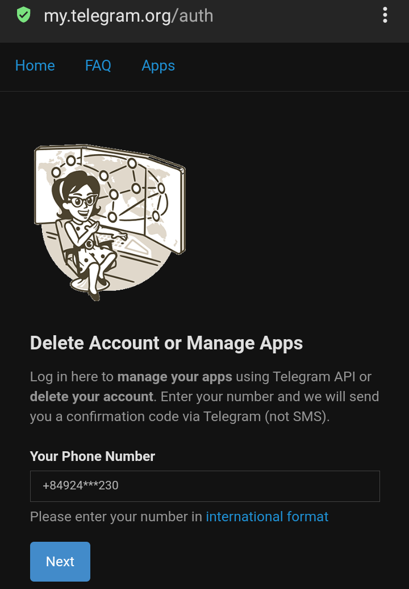
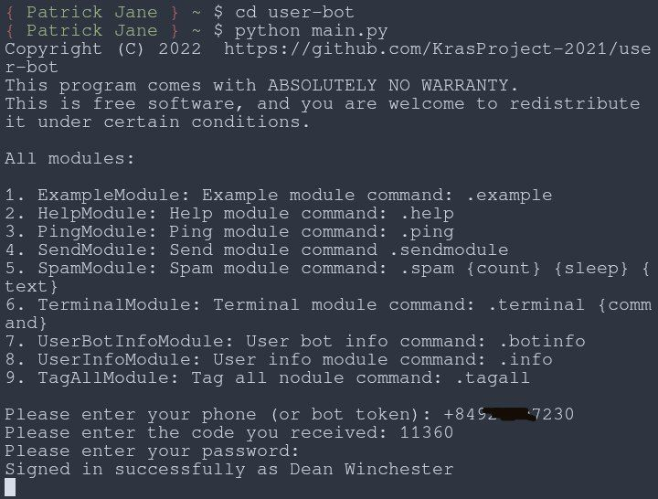

<h1></h1>

<h1>user-bot-documentation</h1>

This is documentation for installation user-bot

<h1>Documentation</h1>
<h2>Starting</h2>

Let's go to the site <a href="https://my.telegram.org"><em>my.telegram.org</em></a>

You need to login following the picture below to get api-id and api-hash and edit <code>config.toml</code> file.

After receiving api-id and api-hash start editing the <code>config.toml</code> file and change the value variables <code>api_id</code> and <code>api_hash</code>.

Now everything, run the <code>main.py</code> file.

Next, we will be asked to enter a phone number. Enter your phone number as shown below.

After entering the phone number, we can go to Telegram and start using the bot.

I recommend entering commands before using the bot <code>.help</code>

<h2>Modules</h2>

If you are a programmer and want to write a module for a user bot then follow the rules below:

<strong>1. The module file must be in the folder "<code>modules</code>".</strong>

<strong>3. Module class name must end with "<code>Module</code>".</strong>

<strong>4. Be sure to inherit the class "<code>TGCLIENT</code>" imported from folder "<code>tgclient.py</code>" which is located in the root directory user bot.</strong>

<strong>5. You can optionally write documentation for the class (optional).</strong>

<strong>6. The main user bot code should be in the function "<code>start</code>".</strong>

Before writing a module, I recommend looking at already written modules in the code.</>
